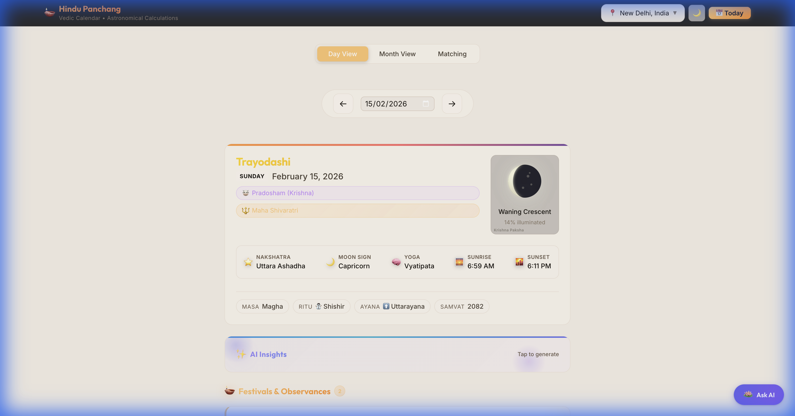
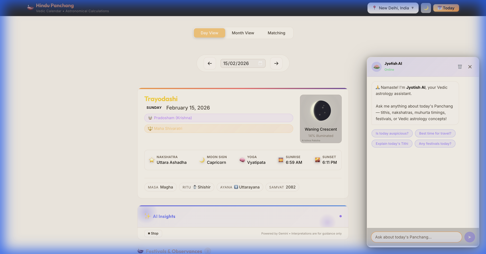

# Panchangam JS

A professional, rigorously tested TypeScript/JavaScript library for calculating Indian Panchangam (Hindu Calendar) elements. Built on high-precision Swiss Ephemeris calculations (`astronomy-engine`) and validated against Drik Panchang data.

[](https://www.npmjs.com/package/@ishubhamx/panchangam-js)
[](https://opensource.org/licenses/MIT)

🌐 **Live Demo**: [hindu-panchang-c1a81.web.app](https://hindu-panchang-c1a81.web.app)

## 📦 Packages

This is a monorepo containing:

| Package | Description | npm |
|---------|-------------|-----|
| [@ishubhamx/panchangam-js](./packages/core) | Core calculation library | [](https://www.npmjs.com/package/@ishubhamx/panchangam-js) |
| [@panchangam/web](./packages/web) | Modern React web application | Private |

## 📸 Screenshots

<p align="center">
  
  <br/>
  <em>Comprehensive Panchang Dashboard</em>
</p>

<p align="center">
  
  
  <br/>
  <em>Left: AI Daily Insights • Right: Interactive Chatbot</em>
</p>

## Features

### Core Panchangam
- **Tithi** — Lunar day (1–30) with precise start/end times & transitions
- **Nakshatra** — Lunar mansion (0–26) with Pada and transitions
- **Yoga** — Solar-lunar combination (0–26)
- **Karana** — Half-tithi periods with transitions
- **Vara** — Day of the week

### Muhurta & Timings
- **Abhijit Muhurta** — Auspicious noon period
- **Brahma Muhurta** — Pre-dawn spiritual window
- **Govardhan Muhurta** — Afternoon auspicious time
- **Choghadiya** — Day & night intervals with Good/Bad ratings
- **Gowri Panchangam** — Day & night intervals with ratings
- **Rahu Kalam, Yamaganda Kalam, Gulika Kalam** — Inauspicious periods
- **Dur Muhurta** — Inauspicious muhurta windows
- **Amrit Kalam & Varjyam** — Auspicious/inauspicious Nakshatra windows

### Vedic Astrology
- **Planetary Positions** — Sun, Moon, Mars, Mercury, Jupiter, Venus, Saturn, Rahu, Ketu
- **Vimshottari Dasha** — Mahadasha, Antardasha, full 120-year cycle
- **Kundli (Birth Chart)** — Bhava calculations and Varga charts (D1–D12)
- **Kundli Matching** — Ashtakoota matching (8 Kootas) with Dosha analysis
- **Tarabalam** — Nakshatra-based daily auspiciousness
- **Chandrashtama** — Moon in 8th house from birth Rashi
- **Disha Shoola** — Directional inauspiciousness by Vara

### Calendar & Festivals
- **Masa, Paksha, Ritu, Ayana, Samvat** — Complete Hindu calendar context
- **80+ Festivals** — Detected automatically based on Udaya Tithi
- **Ekadashi Names** — Named Ekadashis for each Masa/Paksha
- **Sankranti Detection** — Solar ingress dates
- **Special Yogas** — Amrit Siddhi, Sarvartha Siddhi, Guru Pushya, Ravi Pushya

### AI Integration
- **AI Daily Summary** — Insightful, personalized daily overview generated from Panchangam data
- **Jyotish AI Chatbot** — Interactive Vedic astrology assistant for specific queries
- **Bring Your Own Key (BYOK)** — Users can provide their own Gemini API key for higher rate limits
- **Powered by Google Gemini** — Leveraging the latest `gemini-3-flash-preview` model via `@google/genai` SDK

### Day Interpretation Rules
- **Sunrise Anchoring**: All daily attributes (Tithi, Nakshatra, Yoga, Karana, Vara) are calculated at the exact moment of **Sunrise** for the given location.
- **Instantaneous Values**: Planetary positions and Ascendant (Lagna) are calculated for the exact input time provided.

## Accuracy & Validation

- **Real-World Data**: Verified against **200 consecutive days** (Sep 2025 – Apr 2026) of Drik Panchang data with **100% accuracy**
- **Large-Scale Validation**: 98.64% match over 643,797 test cases
- **Long-Term Stability**: Regression tested for 25+ years into the future
- **Unit Testing**: 1075 tests covering edge cases, DST, leap years, and timezone boundaries
- **Performance**: ~5ms per calculation (193 ops/sec)

## Installation

```bash
npm install @ishubhamx/panchangam-js
```

## Quick Start

### ESM (TypeScript / Modern JS)

```typescript
import { getPanchangam, Observer, tithiNames, nakshatraNames } from '@ishubhamx/panchangam-js';

const observer = new Observer(12.9716, 77.5946, 920); // Bangalore
const panchang = getPanchangam(new Date(), observer, {
    timezoneOffset: 330 // IST = UTC+5:30
});

console.log(`Tithi: ${tithiNames[panchang.tithi]}`);
console.log(`Nakshatra: ${nakshatraNames[panchang.nakshatra]}`);
console.log(`Sunrise: ${panchang.sunrise?.toLocaleTimeString()}`);
console.log(`Paksha: ${panchang.paksha}`);
console.log(`Masa: ${panchang.masa.name}`);
console.log(`Ritu: ${panchang.ritu}`);
```

### CommonJS (Node.js)

```javascript
const { getPanchangam, Observer } = require('@ishubhamx/panchangam-js');

const observer = new Observer(19.0760, 72.8777, 10); // Mumbai
const panchang = getPanchangam(new Date(), observer, { timezoneOffset: 330 });
console.log(panchang.tithi);
```

### Advanced Example

```typescript
import { getPanchangam, Observer, rashiNames, yogaNames } from '@ishubhamx/panchangam-js';

const observer = new Observer(12.9716, 77.5946, 920);
const p = getPanchangam(new Date(), observer, { timezoneOffset: 330 });

console.log(`Yoga: ${yogaNames[p.yoga]}`);
console.log(`Sun Rashi: ${p.planetaryPositions.sun.rashiName}`);
console.log(`Dasha: ${p.vimshottariDasha.currentMahadasha.planet} (${p.vimshottariDasha.dashaBalance})`);
console.log(`Brahma Muhurta: ${p.brahmaMuhurta?.start.toLocaleTimeString()} - ${p.brahmaMuhurta?.end.toLocaleTimeString()}`);

// Choghadiya
p.choghadiya.day.forEach(interval => {
    console.log(`${interval.name}: ${interval.startTime.toLocaleTimeString()} (${interval.rating})`);
});

// Festivals
p.festivals.forEach(f => console.log(`🎉 ${f.name} (${f.category})`));
```

## Timezone Handling

**Important**: You should provide `timezoneOffset` in the options for accurate sunrise-anchored calculations.

```typescript
// Helper function to get offset from timezone name
function getTimezoneOffset(timeZone: string, date: Date): number {
    const str = date.toLocaleString('en-US', { timeZone, timeZoneName: 'longOffset' });
    const match = str.match(/GMT([+-]\d{1,2}):?(\d{2})?/);
    if (!match) return 0;
    const sign = match[1].startsWith('+') ? 1 : -1;
    const hours = parseInt(match[1].replace(/[+-]/, ''), 10);
    const minutes = match[2] ? parseInt(match[2], 10) : 0;
    return sign * (hours * 60 + minutes);
}

const offset = getTimezoneOffset('Asia/Kolkata', new Date()); // 330
const panchang = getPanchangam(date, observer, { timezoneOffset: offset });
```

If no offset is provided, the library approximates timezone from longitude (`longitude / 15`), which may be inaccurate for civil day calculations.

### Common Timezones

| Location | Timezone | Offset (minutes) |
|----------|----------|------------------|
| India | Asia/Kolkata | 330 |
| Nepal | Asia/Kathmandu | 345 |
| Sri Lanka | Asia/Colombo | 330 |
| UK | Europe/London | 0 |
| US East | America/New_York | −300 |
| US West | America/Los_Angeles | −480 |
| Singapore | Asia/Singapore | 480 |
| Australia | Australia/Sydney | 660 |

## Usage in Applications

This library is isomorphic — it works in **Node.js**, **Browsers**, and **React Native**.

### 🌐 Web Application

Check out the official web app built with React + Vite:

- **Live**: [hindu-panchang-c1a81.web.app](https://hindu-panchang-c1a81.web.app)
- **Source**: [packages/web](./packages/web)

Features:
- 📅 Monthly calendar with Tithi, Nakshatra, Paksha, and Moon phases
- 🌅 Sunrise/Sunset timeline visualization
- 📊 Panchang timeline chart (Tithi, Nakshatra, Yoga, Karana transitions)
- 🌓 Moon phase visualization
- ⏰ Muhurta timelines (Choghadiya, Gowri)
- 🧭 Disha Shoola compass
- ⭐ Tarabalam wheel
- 🌙 Chandrashtama alerts
- 🎉 Festival detection (80+ festivals)
- 🌙 Dark/Light theme support
- 📍 Location selector with timezone

### React / Next.js Example

```tsx
import { useState, useEffect } from 'react';
import { getPanchangam, Observer, tithiNames } from '@ishubhamx/panchangam-js';

const PanchangComponent = () => {
  const [data, setData] = useState(null);

  useEffect(() => {
    navigator.geolocation.getCurrentPosition((position) => {
      const { latitude, longitude } = position.coords;
      const observer = new Observer(latitude, longitude, 0);
      const panchang = getPanchangam(new Date(), observer);
      setData(panchang);
    });
  }, []);

  if (!data) return <div>Loading...</div>;

  return (
    <div>
      <h1>Today's Panchang</h1>
      <p>Tithi: {tithiNames[data.tithi]}</p>
      <p>Sunrise: {data.sunrise?.toLocaleTimeString()}</p>
    </div>
  );
};
```

### 📱 React Native / Expo

Pure TypeScript with no native dependencies — works out-of-the-box:

```tsx
import { View, Text } from 'react-native';
import { getPanchangam, Observer, tithiNames } from '@ishubhamx/panchangam-js';

export default function App() {
  const observer = new Observer(19.0760, 72.8777, 10);
  const p = getPanchangam(new Date(), observer, { timezoneOffset: 330 });

  return (
    <View style={{ padding: 20 }}>
      <Text>Tithi: {tithiNames[p.tithi]}</Text>
      <Text>Paksha: {p.paksha}</Text>
      <Text>Masa: {p.masa.name}</Text>
    </View>
  );
}
```

### ⚙️ Node.js API

```typescript
import express from 'express';
import { getPanchangam, Observer } from '@ishubhamx/panchangam-js';

const app = express();

app.get('/api/panchang', (req, res) => {
  const { lat, lng, tz } = req.query;
  const observer = new Observer(Number(lat), Number(lng), 10);
  const result = getPanchangam(new Date(), observer, {
    timezoneOffset: Number(tz) || 330
  });
  res.json(result);
});

app.listen(3000);
```

## Development

This project uses npm workspaces for monorepo management.

### Prerequisites

- Node.js >= 18.0.0
- npm >= 8.0.0

### Setup

```bash
git clone https://github.com/ishubhamx/Hindu-Panchangam.git
cd Hindu-Panchangam
npm install
npm run build
```

### Environment Setup (Web App)

To enable AI features:

1. Create a `.env` file in `packages/web`
2. Add your Google Gemini API Key:
   ```
   VITE_GEMINI_API_KEY=your_api_key_here
   ```
   Get a key from [Google AI Studio](https://aistudio.google.com/).

### Available Scripts

| Command | Description |
|---------|-------------|
| `npm run build` | Build all packages |
| `npm run build:core` | Build core library only |
| `npm run build:web` | Build web app only |
| `npm run dev` | Start web development server |
| `npm run test` | Run core library tests |
| `npm run lint` | Lint all packages |
| `npm run deploy` | Deploy web app to Firebase |

### Running Examples

```bash
npx ts-node examples/basic.ts
npx ts-node examples/advanced.ts
npx ts-node examples/transitions.ts
```

### Project Structure

```
Hindu-Panchangam/
├── package.json              # Root workspace config
├── tsconfig.json             # Root TypeScript config
├── packages/
│   ├── core/                 # @ishubhamx/panchangam-js (published to npm)
│   │   ├── src/
│   │   │   ├── core/         # Panchangam, calculations, muhurta, festivals
│   │   │   ├── kundli/       # Birth chart, houses, varga charts
│   │   │   ├── matching/     # Ashtakoota matching, kootas
│   │   │   └── types/        # TypeScript type definitions
│   │   ├── tests/            # 1075 unit tests
│   │   └── package.json
│   └── web/                  # React + Vite web application
│       ├── src/
│       │   ├── components/   # Calendar, DayDetail, Muhurta, MoonPhase, etc.
│       │   ├── hooks/        # usePanchangData, useMonthData
│       │   └── pages/        # MonthView, DayView
│       └── package.json
├── examples/                 # Usage examples
├── scripts/                  # Validation & utility scripts
└── doc/                      # Documentation & verification reports
```

### Contributing

1. Fork the repository
2. Create your feature branch (`git checkout -b feature/amazing-feature`)
3. Commit your changes (`git commit -m 'Add amazing feature'`)
4. Push to the branch (`git push origin feature/amazing-feature`)
5. Open a Pull Request

## License

MIT License. Free for commercial and personal use.